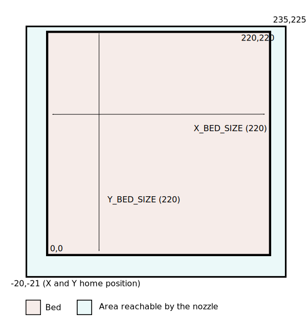

# Configuring Marlin for Unified Bed Leveling

* TOC
{:toc}

Many of the common questions seen on the
[Marlin Discord](https://discord.gg/n5NJ59y) involve setting up the
firmware for for UBL (Unified Bed Leveling). Users find that Marlin
tries to probe outside the bed or doesn't probe the whole bed. This
is usually due to a misunderstanding about how to configure the
leveling process, and the interactions between `X_MIN_POS`, `X_MAX_POS`,
`Y_MIN_POS`, `Y_MAX_POS`, `X_BED_SIZE`, `Y_BED_SIZE`, `MESH_INSET`,
`NOZZLE_TO_PROBE_OFFSET`, and `PROBING_MARGIN`, as well as not
understanding the philosophy behind UBL.

The purpose of this guide is to try to explain how UBL works with
respect to determining the area to probe, and how to set up Marlin for
the best results when using UBL.

Note that this guide only explains how to set up UBL on cartesian
printers (motion systems such as CoreXY are included in the definition of
"cartesian"). It does not include information on setting up UBL for deltas
or SCARA printers.

## The world of UBL - Machine limits and bed position

The most important part of the configuration is ensuring that Marlin has
a proper understanding of where the nozzle can safely move and where the
bed is in relation to those limits.

As an example, let's take a look at my printer. It has a physical bed size
of 220mmx220mm, but the nozzle can safely move to positions outside the
bed on all four sides. When X is homed, the nozzle is 20mm to the left of
the left edge of the bed, when Y is homed the nozzle is 21mm in front of
the front edge of the bed. The nozzle can safely move 15mm past the
right edge of the bed, and 5mm past the back of the bed.

How do we tell Marlin these dimensions? The important concept is that
everything is relative to the front left corner of the bed. That is
coordinate 0,0. We need to define the machine limits with respect to that
position. In the case of my printer, I use the following configuration:

```
define X_BED_SIZE 220
define Y_BED_SIZE 220
...
define X_MIN_POS -20
define Y_MIN_POS -21
define X_MAX_POS (X_BED_SIZE + 15)
define Y_MAX_POS (Y_BED_SIZE + 5)
```
I could also have used
```
define X_MAX_POS 235
define Y_MAX_POS 225
```
but decided to take advantage of the preprocessor available when
compiling Marlin to make it easier to see how the limits relate to the
bed size.

This results in the following layout:



The light blue area shows the machine limits, i.e. where the nozzle
can reach. The pink area is the actual bed. The most important
thing to understand is that in this case (and indeed this is the case
for many printers) the minimum X and Y positions are _negative_,
because they are relative to the 0,0 position which is defined as
being the front left corner of the bed.

## Determining machine limits on a printer that homes to Xmin/Ymin

To use the following procedure you need:

- An LCD display on the printer that can be used to move the nozzle in a
controlled fashion.
- A connection to a terminal through software such as PronterFace,
Repetier Host or OctoPrint.

### Determining `X_MIN_POS` and `Y_MIN_POS`

1. Build Marlin with `X_MIN_POS` and `Y_MIN_POS` both set to 0, and
`X_BED_SIZE`/`Y_BED_SIZE` set correctly. Flash this new Marlin to your
printer and reboot.
2. Connect your terminal and home just X and Y with `G28 X Y`. _Do not use `G28` on its own - we do not want to home Z._
3. The LCD display should show `X=0`,`Y=0` and the nozzle should be as far left and to the front of the bed as it can move, and touching the end stop.
4. Check out where the nozzle is with respect to the front left corner of
the bed. 
5. If the nozzle is exactly over the front left corner of the bed,
congratulations! Your `X_MIN_POS` and `Y_MIN_POS` values are correct, and
you may move to determining the maximum positions.
6. If the nozzle is to the right of the left edge of the bed, or behind
the front edge of the bed, or both, jump to the section "The Xmin/Ymin
position is over the bed".
7. Using the LCD, move the nozzle carefully until it's right over the
front left corner of the bed. Read the X and Y values on the LCD. Take those
values, make them negative, and use them as new values for `X_MIN_POS` and
`Y_MIN_POS`. For example, if when the nozzle is over the front left corner of
the bed you read `X=20` and `Y=21` on the LCD, then use
```
define X_MIN_POS -20
define Y_MIN_POS -21
```
8. Build a new version of Marlin with the new `X_MIN_POS` and `Y_MIN_POS`
settings and upload to your printer.
9. Reboot, do `G28 X Y` followed by `G0 X0 Y0`. The nozzle should end up
right over the front left corner of the bed.
10. Go to section "**Determining `X_MAX_POS` and `Y_MAX_POS`**".

### The Xmin/Ymin position is over the bed.

If either the X minimum position or the Y minimum position is not on the edge
or outside the bed, it means the nozzle cannot reach the whole bed. The
safest solution in this case is to redefine the size of the bed to only
include the area the nozzle can reach.

For example, let's assume that the physical X dimension of the bed is 235mm,
but when the printer homes and the nozzle is at the X minimum end stop it is
over the bed, 8mm in from the edge. In this case, you would configure
`X_MIN_POS` as 0, and reduce `X_BED_SIZE` by 8:
```
#define X_BED_SIZE 227
...
#define X_MIN_POS 0
```

The same applies to the Y axis.

Note that if the nozzle can also not reach the right and/or back edge of the bed,
it may be necessary to reduce the bed size even further - see the next section
about setting the maximum X and Y positions.

### Determining `X_MAX_POS` and `Y_MAX_POS`

Once you have determined and configured the minimum positions following the method
above, it is a simpler proposition to determine and configure the maximum positions.

1. Home X and Y with `G28 X Y`.
2. Disable software end stops with `M211 S0`.
3. With your LCD, _carefully_ move the nozzle to the right back corner of the
bed. Watch carefully for any obstructions to motion (on some printers the
nozzle is unable to reach the back corner of the bed).
4. If possible, _carefully_ move the nozzle to the right and behind the bed as far as it can safely go.
5. The position shown on the display will be your `X_MAX_POS` and `Y_MAX_POS` values.
It is a good idea to lower these by a few millimeters for safety.
6. If either `X_BED_SIZE` is more than the resulting `X_MAX_POS` (or `Y_BED_SIZE` is
more than `Y_MAX_POS`), set `X_BED_SIZE` to the same value as `X_MAX_POS` (or
`Y_BED_SIZE` to `Y_MAX_POS`).

